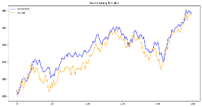

# Multi Input LSTM for Stock Predictions

## Short Description
This project explores the use of a Multi-Input Long Short-Term Memory (LSTM) neural network to predict the profitability of purchasing the SPY index on a given day. The model leverages three distinct LSTMs to enhance predictive accuracy: one processes current news data, another incorporates commodities data along with their correlations over the last five rows, and the third utilizes the Fear and Greed Index to forecast the next day's closing value.

## Model
### Achritecture
- Model Type: Multi-Input-LSTM
    1. **LSTM Architecture**  
        - Each LSTM processes distinct input data streams.  
    - The output of each LSTM is passed through a **Linear Layer**.
    2. **Attention Mechanism**  
        - The outputs of the Linear Layers are combined and forwarded to a **Multihead Attention Layer**.  
    3. **Normalization**  
        - The output from the Attention Layer is normalized using a **LayerNorm Layer**.
    4. **Final Prediction**  
        - A final **Linear Layer** uses the normalized output to predict the next day's closing value.
- Objective: Predict Spy closing prices to generate a trading strategy
### Parameter
- input_size news: 17
- input_size fear and greed: 14
- input_size commodities: 48
- Output Size: 1
- Hidden Size: 1024
- Number of Layers: 1
- Dropout: 0.1
- embed_dim: 2048
- num_heads: 512
#### Training Parameters
- Number of Epochs Stops after 8 epochs without getting better
- batch_size: 1
- seq_lenght: 30
- Max Epochs: 500
- Learning Rate: 0.000001

## Data
- Interval: daily
- Train Data 2015-01-01 to 2022-12-31
- Test Data 2023-01-01 to 2023-12-31

### Data Columns
| Column                | Description                                                                                              | LSTM Data       |
|-----------------------|----------------------------------------------------------------------------------------------------------|-----------------|
| **Date**              | Snapshot date of the data for the specific row                                                           | all             |
| **Open**              | Opening price of the stock or index on the snapshot date                                                 | all             |
| **High**              | Highest price of the stock or index on the snapshot date                                                 | all             |
| **Low**               | Lowest price of the stock or index on the snapshot date                                                  | all             |
| **Close**             | Closing price of the stock or index on the snapshot date                                                 | all             |
| **Adj Close**         | Adjusted closing price, accounting for dividends, stock splits, and other adjustments                    | all             |
| **Volume**            | Total number of shares traded on the snapshot date                                                       | all             |
| **Month**             | Month of the year (1 for January, 2 for February, etc.)                                                  | all             |
| **Weekday**           | Day of the week represented numerically (0 for Monday, 1 for Tuesday, etc.)                              | all             |
| **Trend**             | Binary indicator: 1 if the index shows positive movement (gains) on the snapshot date, 0 otherwise       | news            |
| **RSI**               | Relative Strength Index, a momentum indicator measuring the speed and change of price movements          | news, f & g     |
| **MACD**              | Moving Average Convergence Divergence, a trend-following momentum indicator                              | news, f & g     |
| **MACD_signal**       | Signal line of the MACD, used to identify buy or sell signals                                            | news, f & g     |
| **Bollinger_hband**   | Upper Bollinger Band, indicating potential overbought conditions                                         | news, f & g     |
| **Bollinger_lband**   | Lower Bollinger Band, indicating potential oversold conditions                                           | news, f & g     |
| **Moving_avg**        | Simple or exponential moving average of the stock or index price                                         | news, f & g     |
| **Positive**          | Sentiment indicator: `1 * sentiment_probability` if sentiment is positive, otherwise 0                   | news            |
| **Neutral**           | Sentiment indicator: `1 * sentiment_probability` if sentiment is neutral, otherwise 0                    | news            |
| **Negative**          | Sentiment indicator: `1 * sentiment_probability` if sentiment is negative, otherwise 0                   | news            |
| **Open_{symbol}**     | Opening price of a specific commodity                                                                    | commodities     |
| **Close_{symbol}**    | Closing price of a specific commodity                                                                    | commodities     |
| **Top_Correlation**   | Commodity close column with the highest correlation to SPY's closing value over the last 5 rows          | commodities     |
| **Top_Correlation_Value** | Correlation score of the highest correlating commodity close column                                  | commodities     |
| **Moving_avg**        | Average closing price of SPY over the last 3 days                                                        | news            |
| **Fear Greed**        | Fear and Greed Index score                                                                               | f & g           |
| **Y**                 | Closing price of the stock or index for the next day, used as the target variable for modeling           | all             |

## Tests
With the model's general structure in place, we conducted additional experiments to determine the optimal parameters for performance. Specifically, we evaluated the impact of varying the number of attention heads and the embedding dimension (embed_dim) on the model's predictive accuracy.

### Attention Heads
Through testing, we identified that the optimal relationship between `embed_dim` and `num_heads` in our specific use case is 1:4. As a result, we adopted this ratio for all subsequent experiments to ensure consistency and maximize performance.

| embed_dim | num_heads | hidden_size | num_layers | dropout | batch_size | seq_size | learning_rate | min_train_loss  | min_test_loss   | MSE   | MAE  |
|-----------|-----------|-------------|------------|---------|------------|----------|---------------|-----------------|-----------------|-------|------|
| 1024      | 1         | 128         | 1          | 0.1     | 1          | 30       | 1             | 0.004281795901  | 0.001298544319  | 112.77| 8.86 |
| 1024      | 4         | 128         | 1          | 0.1     | 1          | 30       | 1             | 0.0008968206959 | 0.000689763193  | 59.9  | 5.97 |
| 1024      | 16        | 128         | 1          | 0.1     | 1          | 30       | 1             | 0.0009856331889 | 0.000782566375  | 67.96 | 6.65 |
| 1024      | 64        | 128         | 1          | 0.1     | 1          | 30       | 1             | 0.0009122705476 | 0.0005548565784 | 48.18 | 5.64 |
| 1024      | 128       | 128         | 1          | 0.1     | 1          | 30       | 1             | 0.0007878986284 | 0.0005246848518 | 45.56 | 5.36 |
| 1024      | 256       | 128         | 1          | 0.1     | 1          | 30       | 1             | 0.0005132757212 | 0.0004304810734 | 37.38 | 4.99 |
| 1024      | 512       | 128         | 1          | 0.1     | 1          | 30       | 1             | 0.001690219664  | 0.0006934909643 | 60.22 | 6.31 |
| 1024      | 1024      | 128         | 1          | 0.1     | 1          | 30       | 1             | 0.001000287134  | 0.0004669899086 | 40.55 | 5.21 |

| Attention Heads 1   | Attention Heads 64  | Attention Heads 1024 |
| ------------------- | ------------------- | ------------------- |
|  |  |  |
|  |  |  |
|  |  |  |

### Embedding Dimension
Generally, larger embedding dimensions tend to improve the model's accuracy. However, smaller embedding dimensions outperform medium-sized ones, indicating that excessively large dimensions may not always lead to better performance compared to more compact representations.

| embed_dim | num_heads | hidden_size | num_layers | dropout | batch_size | seq_size | learning_rate | min_train_loss   | min_test_loss    | MSE    | MAE  |
|-----------|-----------|-------------|------------|---------|------------|----------|---------------|------------------|------------------|--------|------|
| 16        | 4         | 128         | 1          | 0.1     | 1          | 30       | 1             | 0.0005006130262  | 0.000610150577   | 52.99  | 5.68 |
| 32        | 8         | 128         | 1          | 0.1     | 1          | 30       | 1             | 0.0005949895904  | 0.0005882620583  | 51.09  | 5.70 |
| 64        | 16        | 128         | 1          | 0.1     | 1          | 30       | 1             | 0.0008550233409  | 0.0007075768782  | 61.45  | 6.22 |
| 128       | 32        | 128         | 1          | 0.1     | 1          | 30       | 1             | 0.01865097397    | 0.003028042594   | 262.96 | 13.68|
| 256       | 64        | 128         | 1          | 0.1     | 1          | 30       | 1             | 0.002178446422   | 0.0009729182291  | 84.49  | 7.27 |
| 512       | 128       | 128         | 1          | 0.1     | 1          | 30       | 1             | 0.0006185889002  | 0.0005987172271  | 51.99  | 5.83 |
| 1024      | 256       | 128         | 1          | 0.1     | 1          | 30       | 1             | 0.0005944981173  | 0.0004110352377  | 35.70  | 4.82 |
| 2048      | 512       | 128         | 1          | 0.1     | 1          | 30       | 1             | 0.0007996202102  | 0.0004026610167  | 34.97  | 4.62 |

## Performance Criteria
The model aims to outperform the overall performance of the SPY index in 2023.

## Backtesting
In our Backtesting we used different Strategies to test the Performance difference for the same model between different strategies.
### Setup
- Backtesting Library: [Lumibot](https://lumibot.lumiwealth.com/index.html)
- Trading criteria: Predictes Close is higher than current Close

| cagr market | com return market | cagr    | com return  | Stop Loss | cash at risk | take profit | careful        |
|--------------|-------------------|---------|-------------|-----------|--------------|-------------|--------------|
| 27.16%       | 26.74%            | 8.24%   | 8.13%       | 0         | -            | -           | -            |
| 27.16%       | 26.74%            | 8.24%   | 8.13%       | 0.95      | 0.5          | -           | -            |
| 27.16%       | 26.74%            | 8.80%   | 8.67%       | 0.95      | 0.8          | -           | -            |
| 27.16%       | 26.74%            | 9.13%   | 9%          | 0.95      | 1            | 1.2         | careful short* |
| 27.16%       | 26.74%            | 8.80%   | 8.67%       | 0.95      | 0.8          | 1.2         | -            |
| 27.16%       | 26.74%            | 9.13%   | 9.00%       | 0.95      | 1            | 1.2         | -            |
| 27.16%       | 26.74%            | 22.48%   | 22.14%       | 0.95      | 1            | 1.2         | careful short, careful buy |

**careful short: `pred*1.15 < last_price`*
**careful buy: `pred*1.05 > last_price`*

### Results
The model generates a 9.00% return compared to the 26.74% return of the SPY index. When the model incorporates shorting the index during expected downturns, it results in a high CAGR but poor overall returns. This is because the model initially performs well but fails to capture significant market jumps. To mitigate this, we implemented a "careful short" strategy, yet even with this adjustment, the model does not outperform a straightforward buy-only strategy. However when implementing a careful buy strategy and a careful short strategy the model is able to score a comulative return of 22.14%, which is still not better than the market but the closest we could get during our testing.The model generates a 9.00% return, compared to the 26.74% return of the SPY index. When incorporating shorting during expected downturns, the model achieves a high CAGR but poor overall returns, as it performs well initially but struggles to capture significant market jumps. To address this, a "careful short" strategy was introduced, but even with this adjustment, the model still underperforms a simple buy-only strategy. However, by combining a careful buy strategy with the careful short approach, the model achieves a cumulative return of 22.14%. While this still falls short of the market, it represents the closest we could get during our testing.

All tests in this table have been using those Parameters: 
cash at risk: 1, stop loss: 0.95, take profit: 1.2
| Buy only | Careful Short | Careful Buy, Short |
| -------- | --------------- | ----------------- |
|  |  |  |
|  |  |  |
|  |  |  |
 
As shown in the images, a "careful short" in our example effectively translates to no shorting at all. This suggests that the model struggles to accurately predict falling stock prices.

In order to get a more detailt view of the performance of each trading strategy take a look at our [tearsheets and trades](results/)

## Conclusion
The backtesting was performed using our final model, which was trained with the parameters outlined earlier. This model achieved a minimum test loss of 0.0004085484247, resulting in a Mean Squared Error (MSE) of 35.48. These results indicate that this model outperforms all others tested, making it the most effective model in our experiments.

Despite the promising structure of the Multi-Input LSTM model, it was unable to outperform the market in this particular setup. The model's performance varied depending on the strategy applied, with the "careful short" approach essentially having no effect due to its failure to predict market downturns. When combining "careful buy" and "careful short," the model achieved a cumulative return of 22.14%, still falling short of the SPY index's 26.74% return. This indicates that the model struggles to capture significant market movements, and further testing with different symbols, datasets, and model variations is necessary to improve performance and better compete with the market.