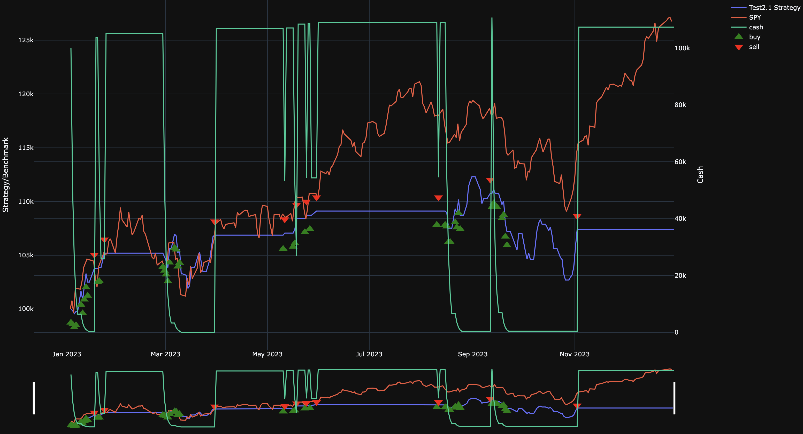

# LSTM for Stock Predictions

## Short Description
This project investigates the application of a Long Short-Term Memory (LSTM) neural network to predict the profitability of buying the SPY index on a given day. To enhance the model's accuracy, current news data is processed through a sentiment analysis model. The resulting sentiment scores are then incorporated as additional features to assist the LSTM model in predicting the next day's closing value.
## Model
### Achritecture
- Model Type: LSTM
- Objective: Predict Spy closing prices to generate a trading strategy
### Parameter
- Input Size: 17
- Output Size 1
- Hidden Size 1000
- Number of Layers 1
- Dropout 0.2
#### Training Parameters
- Number of Epochs Stops after 8 epochs without getting better
- batch_size: 1
- seq_lenght: 30
- Max Epochs: 500
- Learning Rate 0.00001
## Data
- Interval: daily
- Train Data 2015-01-01 to 2022-12-31
- Train Data 2023-01-01 to 2023-12-31

| Column            | Description                                                                                     |
|--------------------|-------------------------------------------------------------------------------------------------|
| Date              | Snapshot date of data inside one specific row                                                   |
| Open              | Opening price of the stock or index on the snapshot date                                        |
| High              | Highest price of the stock or index on the snapshot date                                        |
| Low               | Lowest price of the stock or index on the snapshot date                                         |
| Close             | Closing price of the stock or index on the snapshot date                                        |
| Adj Close         | Adjusted closing price, accounting for dividends, stock splits, and other adjustments           |
| Volume            | Total number of shares traded on the snapshot date                                              |
| Month             | Number of the month (1 for January, 2 for February, etc.)                                       |
| Weekday           | Day of the week represented numerically (0 for Monday, 1 for Tuesday, etc.)                     |
| News_probability  | Probability score indicating the sentiment strength of news (e.g., positive, neutral, or negative)|
| Trend             | Binary indicator: 1 if the index is positive (gains) on the snapshot date, 0 otherwise          |
| Sentiment_int     | Encoded sentiment score: 1 for positive, 0 for neutral, and -1 for negative sentiment            |
| RSI               | Relative Strength Index, a momentum indicator measuring the speed and change of price movements |
| MACD              | Moving Average Convergence Divergence, a trend-following momentum indicator                     |
| MACD_signal       | Signal line of the MACD, used to identify buy or sell signals                                   |
| Bollinger_hband   | Upper Bollinger Band, indicating potential overbought conditions                                |
| Bollinger_lband   | Lower Bollinger Band, indicating potential oversold conditions                                  |
| Moving_avg        | Simple or exponential moving average of the stock or index price                                |
| Y                 | Closing price of the stock or index for the next day, used as the target variable for modeling   |

## Tests
With the general structure of the model established, we conducted further experiments to identify the optimal performing parameters. Specifically, we examined the impact of different dropout rates on the model's performance.

### Dropout Rate

From the table, we can see that a dropout rate of 0.1 yields the lowest test loss, indicating the best performance in terms of generalization. A dropout rate of 0 shows a similar test loss but with a higher train loss, which could suggest slight overfitting. As the dropout rate increases (to 0.2 and 0.3), the test loss also increases, implying that too much regularization may hinder the model's ability to generalize effectively.

| Dropout Rate | Hidden Size | Seq Size | Batch Size | Num Layers | Test Loss       | Train Loss      |
|--------------|-------------|----------|------------|------------|-----------------|-----------------|
| 0            | 1000        | 30       | 1          | 1          | 0.000465637598  | 0.001337633458  |
| 0.1          | 1000        | 30       | 1          | 1          | 0.0004639611923 | 0.001386569666  |
| 0.2          | 1000        | 30       | 1          | 1          | 0.0004742596618 | 0.001316635644  |
| 0.3          | 1000        | 30       | 1          | 1          | 0.0004687525645 | 0.001318592983  |

## Performance Criteria
The model with the parameters yielding the lowest loss will be integrated into a trading strategy, aiming to outperform the overall performance of the SPY index.
## Backtesting
### Setup
- Backtesting Library: [Lumibot](https://lumibot.lumiwealth.com/index.html)
- Trading criteria: Predictes Close is higher than current Close
- Cash at Risk: 50% of available money
### Results
The Model generates 7.48% CAGR compared to 27.16% CAGR.
| Comulative Return | Monthly Returns | Trades |
| ----------------- | ------------------- | ------ |
|  |  |  |

For more detailed results, check out the [tearsheet](results/tearsheet.html) and the [trades](results/trades.html) executed by our model.

## Conclusion
An LSTM model can understand the data and predict the closing value with reasonable accuracy. However, this doesn't necessarily mean that the model is suited for use as an effective trading strategy.

