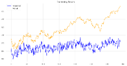

# Linear Neuronal Network for Stock Predictions

## Short Description
This project investigates the application of a Linear neural network to predict the profitability of buying the SPY index on a given day. To enhance the model's accuracy, current news data is processed through a sentiment analysis model. The resulting sentiment scores are then incorporated as additional features to assist the Linear model in predicting the next day's closing value.
## Model
### Achritecture
- Model Type: Linear
- Objective: Predict Spy closing prices to generate a trading strategy
### Parameter
- Input Size: 17
- Output Size 1
- Hidden Size 1000
- Number of Layers 2
- Dropout 0.3
#### Training Parameters
- Number of Epochs Stops after 8 epochs without getting better
- Max Epochs: 500
- Learning Rate 0.00001
## Data
- Interval: daily
- Train Data 2015-01-01 to 2022-12-31
- Train Data 2023-01-01 to 2023-12-31

| Column            | Description                                                                                     |
|--------------------|-------------------------------------------------------------------------------------------------|
| Date              | Snapshot date of data inside one specific row                                                   |
| Open              | Opening price of the stock or index on the snapshot date                                        |
| High              | Highest price of the stock or index on the snapshot date                                        |
| Low               | Lowest price of the stock or index on the snapshot date                                         |
| Close             | Closing price of the stock or index on the snapshot date                                        |
| Adj Close         | Adjusted closing price, accounting for dividends, stock splits, and other adjustments           |
| Volume            | Total number of shares traded on the snapshot date                                              |
| Month             | Number of the month (1 for January, 2 for February, etc.)                                       |
| Weekday           | Day of the week represented numerically (0 for Monday, 1 for Tuesday, etc.)                     |
| News_probability  | Probability score indicating the sentiment strength of news (e.g., positive, neutral, or negative)|
| Trend             | Binary indicator: 1 if the index is positive (gains) on the snapshot date, 0 otherwise          |
| Sentiment_int     | Encoded sentiment score: 1 for positive, 0 for neutral, and -1 for negative sentiment            |
| RSI               | Relative Strength Index, a momentum indicator measuring the speed and change of price movements |
| MACD              | Moving Average Convergence Divergence, a trend-following momentum indicator                     |
| MACD_signal       | Signal line of the MACD, used to identify buy or sell signals                                   |
| Bollinger_hband   | Upper Bollinger Band, indicating potential overbought conditions                                |
| Bollinger_lband   | Lower Bollinger Band, indicating potential oversold conditions                                  |
| Moving_avg        | Simple or exponential moving average of the stock or index price                                |
| Y                 | Closing price of the stock or index for the next day, used as the target variable for modeling   |

## Tests
With the general structure of the model established, we conducted further experiments to identify the optimal performing parameters. Specifically, we examined the impact of varying the number of layers and different dropout rates on the model's performance.
### Number of Layer
| Hidden_size | Layers | Dropout | Epoch (incl. Early Stopping) | LR       | Std Train Loss | Std Test Loss | Min Train Loss | Min Test Loss |
|-------------|--------|---------|-----------------------------|----------|----------------|---------------|----------------|---------------|
| 1000        | 1      | 0.2     | 500                         | 0.00001  | 0.08753229656  | 0.242315361   | 0.1078731269   | 0.1155110672  |
| 1000        | 2      | 0.2     | 500                         | 0.00001  | 0.03544898374  | 0.1403483018  | 0.09973020107  | 0.1092730537  |
| 1000        | 4      | 0.2     | 500                         | 0.00001  | 0.04827607973  | 0.1736620319  | 0.08927936107  | 0.1182617769  |
| 1000        | 8      | 0.2     | 500                         | 0.00001  | 0.04009733149  | 0.1644326706  | 0.08136714995  | 0.1240972281  |
| 1000        | 20     | 0.2     | 500                         | 0.00001  | 0.05234578731  | 0.1781142246  | 0.07744527608  | 0.1513808519  |
| 1000        | 100    | 0.2     | 500                         | 0.00001  | 0.05999699049  | 0.1950505233  | 0.07787307352  | 0.1477558017  |

As shown in the table, models with fewer layers generally exhibit better performance, with the 2-layer configuration achieving the best results in this example. Additionally, models with a higher number of layers appear to have a tendency to predict more linear patterns, which may limit their ability to capture complex relationships.

| Model predictions with one Layer: | Model predictions with 4 Layer: | Model predictions with 100 Layer: |
| --------------------------------- | --------------------------------- | --------------------------------- |
|     | |  |

### Dropout Rate
The table below summarizes the impact of different dropout rates on the model's performance. For this specific model configuration, the dropout rate appears to have minimal influence on performance metrics, with test loss remaining relatively stable across most dropout levels. However, an excessively high dropout rate shows a noticeable negative effect on test loss, suggesting diminished model efficacy in these cases.

| Hidden_size | Layers | Dropout | Epoch (incl. Early Stopping) | LR       | Std Train Loss | Std Test Loss | Min Train Loss | Min Test Loss |
|-------------|--------|---------|-----------------------------|----------|----------------|---------------|----------------|---------------|
| 1000        | 2      | 0       | 500                         | 0.00001  | 0.0435993297   | 0.158906454   | 0.09756575525  | 0.1097109243  |
| 1000        | 2      | 0.1     | 500                         | 0.00001  | 0.05354070347  | 0.1782084622  | 0.1007457003   | 0.108166635   |
| 1000        | 2      | 0.15    | 500                         | 0.00001  | 0.06277072371  | 0.1976308127  | 0.09844984114  | 0.107987389   |
| 1000        | 2      | 0.2     | 500                         | 0.00001  | 0.05549883682  | 0.1835590479  | 0.1008404866   | 0.1090265885  |
| 1000        | 2      | 0.25    | 500                         | 0.00001  | 0.05798162278  | 0.1896106422  | 0.1007944196   | 0.1089174747  |
| 1000        | 2      | 0.3     | 500                         | 0.00001  | 0.03265395543  | 0.1327094697  | 0.1003190503   | 0.1120033562  |

| Model predictions with one Layer: | Model predictions with 4 Layer: | Model predictions with 100 Layer: |
| --------------------------------- | --------------------------------- | --------------------------------- |
|     | |  |

## Performance Criteria
The model with the parameters yielding the lowest loss will be integrated into a trading strategy, aiming to outperform the overall performance of the SPY index.
## Backtesting
### Setup
- Backtesting Library: [Lumibot](https://lumibot.lumiwealth.com/index.html)
- Trading criteria: Predictes Close is higher than current Close
- Cash at Risk: 50% of available money
### Results
The Model does never Trades and therefore there are no Backtesting results.
## Conclusion
Stock market predictions are a challenging problem that cannot be effectively solved with a linear model, at least with this dataset.