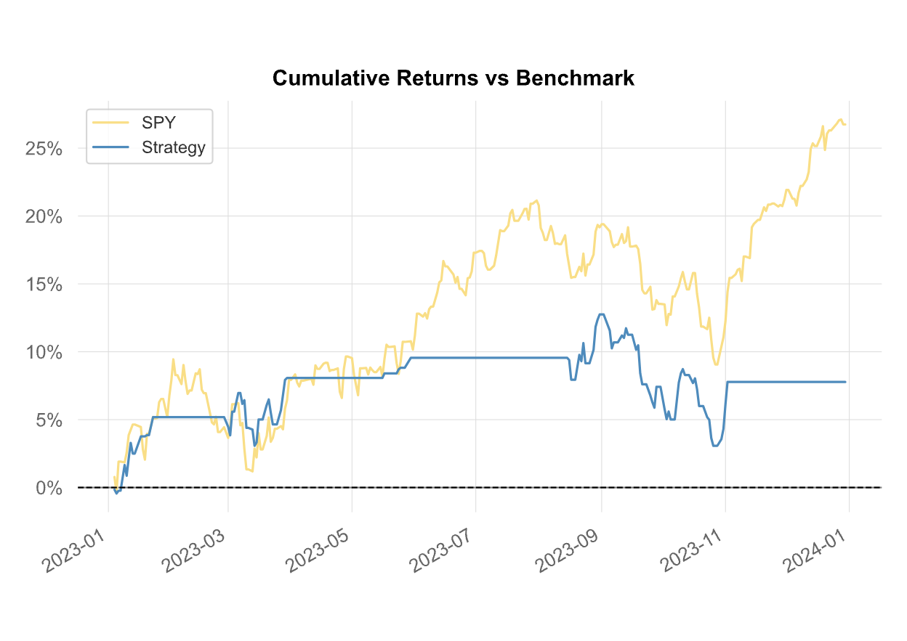

# LSTM for Stock Predictions

## Short Description
This project investigates the application of a Long Short-Term Memory (LSTM) neural network to predict the profitability of buying the SPY index on a given day. To enhance the model's accuracy, current news data is processed through a sentiment analysis model. The resulting sentiment scores are then incorporated as additional features to assist the LSTM model in predicting the next day's closing value.
This Model is using the exact same parameters, data and model structur as in [test 2.1](../Test2.1%20-%20News%20LSTM/README.md)
, however the data is structured in a different way.
## Model
### Achritecture
- Model Type: LSTM
- Objective: Predict Spy closing prices to generate a trading strategy
### Parameter
- Input Size: 17
- Output Size 1
- Hidden Size 1000
- Number of Layers 1
- Dropout 0.2
#### Training Parameters
- Number of Epochs Stops after 8 epochs without getting better
- batch_size: 1
- seq_lenght: 30
- Max Epochs: 500
- Learning Rate 0.00001
## Data
- Interval: daily
- Train Data 2015-01-01 to 2022-12-31
- Train Data 2023-01-01 to 2023-12-31

| Column            | Description                                                                                             |
|-------------------|---------------------------------------------------------------------------------------------------------|
| Date              | Snapshot date of the data for the specific row                                                          |
| Open              | Opening price of the stock or index on the snapshot date                                                |
| High              | Highest price of the stock or index on the snapshot date                                                |
| Low               | Lowest price of the stock or index on the snapshot date                                                 |
| Close             | Closing price of the stock or index on the snapshot date                                                |
| Adj Close         | Adjusted closing price, accounting for dividends, stock splits, and other adjustments                   |
| Volume            | Total number of shares traded on the snapshot date                                                    |
| Month             | Month of the year (1 for January, 2 for February, etc.)                                                |
| Weekday           | Day of the week represented numerically (0 for Monday, 1 for Tuesday, etc.)                             |
| Trend             | Binary indicator: 1 if the index shows positive movement (gains) on the snapshot date, 0 otherwise      |
| RSI               | Relative Strength Index, a momentum indicator measuring the speed and change of price movements          |
| MACD              | Moving Average Convergence Divergence, a trend-following momentum indicator                             |
| MACD_signal       | Signal line of the MACD, used to identify buy or sell signals                                          |
| Bollinger_hband   | Upper Bollinger Band, indicating potential overbought conditions                                       |
| Bollinger_lband   | Lower Bollinger Band, indicating potential oversold conditions                                         |
| Moving_avg        | Simple or exponential moving average of the stock or index price                                       |
| Positive          | If sentiment is positive, 1 * sentiment_probability, otherwise 0                                        |
| Neutral           | If sentiment is neutral, 1 * sentiment_probability, otherwise 0                                         |
| Negative          | If sentiment is negative, 1 * sentiment_probability, otherwise 0                                        |
| Y                 | Closing price of the stock or index for the next day, used as the target variable for modeling          |

## Performance Criteria
The model aims to outperform the overall performance of the SPY index in 2023 and achieve a higher return than the results achieved in [test 2.1](../Test2.1%20-%20News%20LSTM/README.md).
## Backtesting
### Setup
- Backtesting Library: [Lumibot](https://lumibot.lumiwealth.com/index.html)
- Trading criteria: Predictes Close is higher than current Close
- Cash at Risk: 50% of available money
### Results
The model generates a 7.89% CAGR, outperforming the SPY (S&P 500) index, which recorded a 27.16% CAGR. In comparison, the model from Test 2.1 achieved only a 7.48% CAGR. This suggests that the way the training and test data is structured—despite using the same dataset—can significantly impact the model's performance. However, it's important to note that the performance difference is relatively small, which may indicate that some of the result could be due to luck, as neural networks don't always produce the same outcome for identical inputs.

| Test 2.1 | Test 2.3 |
|----- | ------ |
| |  |
|  |  |
|  |  |

For more detailed results, check out the [tearsheet](results/tearsheet.html) and the [trades](results/trades.html) executed by our model.

## Conclusion
Further testing is needed to confirm that different data structuring truly impacts performance. However, initial results suggest that the way the data is organized does have an effect on the model's performance.
