# LSTM for Stock Predictions

## Short Description
This Test explores the use of a Long Short-Term Memory (LSTM) neural network to predict the profitability of buying the DAX index on a given day. Unlike in Test 1, where a different target was predicted, this model focuses on forecasting the next day's Close value to assess profitability.
## Model
### Architecture
- Model Type: LSTM
- Objective: Predict DAX closing prices to generate a trading strategy
### Parameter
- Input Size: 13
- Output Size 1
- Hidden Size 1000
- Number of Layers 1
- Dropout 0.2
#### Training Parameters
- Number of Epochs Stops after 8 epochs without getting better
- batch_size: 1
- seq_lenght: 30
- Max Epochs: 500
- Learning Rate 0.0001
## Data
- Interval: daily
- Train Data 2015-01-01 to 2022-12-31
- Train Data 2023-01-01 to 2023-12-31

| Column            | Description                                                                                     |
|--------------------|-------------------------------------------------------------------------------------------------|
| Date              | Snapshot date of data inside one specific row                                                   |
| Open              | Opening price of the stock or index on the snapshot date                                        |
| High              | Highest price of the stock or index on the snapshot date                                        |
| Low               | Lowest price of the stock or index on the snapshot date                                         |
| Close             | Closing price of the stock or index on the snapshot date                                        |
| Adj Close         | Adjusted closing price, accounting for dividends, stock splits, and other adjustments           |
| Volume            | Total number of shares traded on the snapshot date                                              |
| Month             | Number of the month (1 for January, 2 for February, etc.)                                       |
| Weekday           | Day of the week represented numerically (0 for Monday, 1 for Tuesday, etc.)                     |
| RSI               | Relative Strength Index, a momentum indicator measuring the speed and change of price movements |
| MACD              | Moving Average Convergence Divergence, a trend-following momentum indicator                     |
| MACD_signal       | Signal line of the MACD, used to identify buy or sell signals                                   |
| Bollinger_hband   | Upper Bollinger Band, indicating potential overbought conditions                                |
| Bollinger_lband   | Lower Bollinger Band, indicating potential oversold conditions                                  |
| Y                 | Closing price of the stock or index for the next day, used as the target variable for modeling   |

## Tests
With the model's general structure established, we conducted further experiments to identify the optimal parameters for performance. Specifically, we explored the impact of varying dropout rates, batch sizes, number of layers, and sequence lengths on the model's effectiveness.
### Batch Size
Our experiments revealed a notable improvement in test loss when using a batch size of 1. Smaller batch sizes appear to enhance the model's ability to generalize, likely due to the noisier gradient updates that provide a form of implicit regularization. These findings demonstrate that a batch size of 1 achieves the lowest test loss (0.00196044208), suggesting that smaller batch sizes may be better suited for this LSTM model's training.

| Hidden_size | Layers | Dropout | Batch Size | Epochs | LR     | Seq Size | Std Train Loss | Std Test Loss | Min Train Loss | Min Test Loss |
|-------------|--------|---------|------------|--------|--------|----------|----------------|---------------|----------------|---------------|
| 10          | 3      | 0.2     | 32         | 10     | 0.0001 | 30       | 0.02134354572  | 0.07338211582 | 0.04476645574  | 0.1415258348  |
| 10          | 3      | 0.2     | 16         | 10     | 0.0001 | 30       | 0.07187879097  | 0.1693946502  | 0.04505162529  | 0.1476521807  |
| 10          | 3      | 0.2     | 8          | 10     | 0.0001 | 30       | 0.01703433681  | 0.02277452368 | 0.04423442788  | 0.1238738721  |
| 10          | 3      | 0.2     | 4          | 10     | 0.0001 | 30       | 0.01703433681  | 0.01864907894 | 0.0416699886   | 0.0884692805  |
| 10          | 3      | 0.2     | 2          | 10     | 0.0001 | 30       | 0.0204988883   | 0.02399956463 | 0.03428365708  | 0.04624732525 |
| 10          | 3      | 0.2     | 1          | 10     | 0.0001 | 30       | 0.01005388863  | 0.00196044208 | 0.002538331191 | 0.001745343078|

| Batch Size 1 | Batch Size 2 |
| ---------- | -------------- |
| 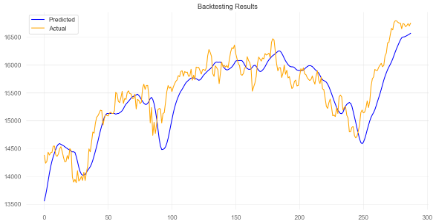 | 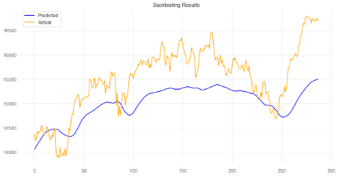 |

### Number of Layer (with adjusted neurons)
When varying the number of layers, we observed that increasing the layers did not consistently improve performance. Models with fewer layers (e.g., 1 or 2) achieved better test loss compared to those with more layers. This suggests that deeper architectures may overfit or fail to generalize effectively in this specific setup.

**Key Observations**:
- The model with 1 layer achieved the lowest test loss (0.0006343273185), indicating it is the most effective architecture for this task.
- The simplest architecture (1 layer, hidden size 100) provided both the best performance and efficient training.

| Hidden_size | Layers | Dropout | Batch Size | Epochs | LR     | Seq Size | Std Train Loss | Std Test Loss | Min Train Loss | Min Test Loss |
|-------------|--------|---------|------------|--------|--------|----------|----------------|---------------|----------------|---------------|
| 100         | 1      | 0.2     | 1          | 10     | 0.0001 | 30       | 0.003394091969 | 0.00074576993 | 0.0009632966689| 0.0006343273185|
| 50          | 2      | 0.2     | 1          | 10     | 0.0001 | 30       | 0.005308381346 | 0.0008083330298| 0.001728001965 | 0.0009133790236|
| 25          | 4      | 0.2     | 1          | 10     | 0.0001 | 30       | 0.005460911254 | 0.0006293202345| 0.002646918562 | 0.002043520484|
| 20          | 5      | 0.2     | 1          | 10     | 0.0001 | 30       | 0.009101874209 | 0.001295847302| 0.003391817064 | 0.002692347739|
| 10          | 10     | 0.2     | 1          | 10     | 0.0001 | 30       | 0.03315671126  | 0.04933890964 | 0.008188548584| 0.004846389764|

| 1 Layer | 10 Layer |
| -------- | ------- |
| 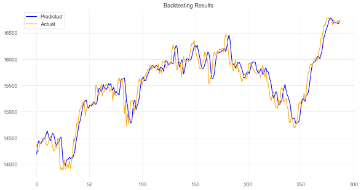 | 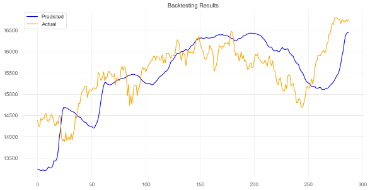 |

### Sequence Size
This experiment varied the sequence size to explore its impact on the model's ability to learn temporal dependencies. The results reveal the trade-offs between shorter and longer sequences.

| Hidden_size | Layers | Dropout | Batch Size | Epochs | LR     | Seq Size | Std Train Loss | Std Test Loss | Min Train Loss | Min Test Loss |
|-------------|--------|---------|------------|--------|--------|----------|----------------|---------------|----------------|---------------|
| 10          | 1      | 0.2     | 1          | 10     | 0.0001 | 5        | 0.04667865738  | 0.01267980496 | 0.00110807625  | 0.000945559573|
| 10          | 1      | 0.2     | 1          | 10     | 0.0001 | 10       | 0.0118436272   | 0.001002276435| 0.001083619392 | 0.0009533782221|
| 10          | 1      | 0.2     | 1          | 10     | 0.0001 | 15       | 0.0009533782221| 0.004213728413| 0.001083747237 | 0.0009030580146|
| 10          | 1      | 0.2     | 1          | 10     | 0.0001 | 20       | 0.02011714762  | 0.01970748076 | 0.001113734151 | 0.0009594722117|
| 10          | 1      | 0.2     | 1          | 10     | 0.0001 | 30       | 0.02089162572  | 0.01146074642 | 0.0009518654191| 0.0008360761497|
| 10          | 1      | 0.2     | 1          | 10     | 0.0001 | 50       | 0.03868049825  | 0.003617036628| 0.001080928963 | 0.0008495307  |

| Sequence Size 5 | Sequence Size 15 |
| -------- | ------- |
| 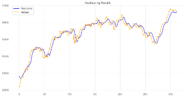 | 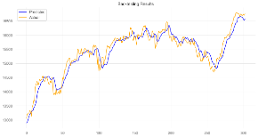 |

**Key Observations**:
- A sequence size of 30 yielded the best test loss (0.0008360761497), suggesting it captures relevant temporal patterns effectively without overfitting.
- Shorter sequences (e.g., 5 or 10) led to suboptimal performance, likely due to insufficient temporal context.
- Longer sequences (e.g., 50) increased variability (std train loss = 0.03868049825) and degraded test loss performance, possibly due to overfitting or difficulty in training with extended input.

### Number of Layer (same amount of neurons)
This experiment kept the number of neurons constant (hidden size = 10) while varying the number of layers. The results demonstrate that adding more layers does not improve performance as we thought initially, in fact in nearly all cases, it degrades it. The 2-layer model achieved the lowest test loss (0.0006246936557), suggesting it struck a good balance between capacity and generalization.

| Hidden_size | Layers | Dropout | Batch Size | Epochs | LR     | Seq Size | Std Train Loss | Std Test Loss | Min Train Loss | Min Test Loss |
|-------------|--------|---------|------------|--------|--------|----------|----------------|---------------|----------------|---------------|
| 10          | 1      | 0.2     | 1          | 10     | 0.0001 | 30       | 0.02930254557  | 0.006669619905| 0.00120394235  | 0.0009225543621|
| 10          | 2      | 0.2     | 1          | 10     | 0.0001 | 30       | 0.01022417343  | 0.0006246936557| 0.002457697343 | 0.001554371373 |
| 10          | 4      | 0.2     | 1          | 10     | 0.0001 | 30       | 0.02350522708  | 0.008697065867| 0.003935666787 | 0.002760068769 |
| 10          | 5      | 0.2     | 1          | 10     | 0.0001 | 30       | 0.01029944152  | 0.008326160711| 0.00414450992  | 0.003206792117 |
| 10          | 10     | 0.2     | 1          | 10     | 0.0001 | 30       | 0.04069970922  | 0.03786117548 | 0.01019372626  | 0.007941706101 |

| 1 Layer |  10 Layer |
| -------- | ------- |
| 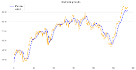 | 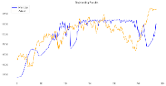 |

## Performance Criteria
The model with the parameters yielding the lowest loss will be integrated into a trading strategy, aiming to outperform the overall performance of the DAX index.
## Backtesting
### Setup
- Backtesting Library: [Lumibot](https://lumibot.lumiwealth.com/index.html)
- Trading criteria: Predictes Close is higher than current Close
- Cash at Risk: 50% of available money
### Results
The model achieves a cumulative return of 7.61%, significantly underperforming the benchmark cumulative return of 15.6%. One contributing factor to this lower return is that the model begins trading only after approximately three months.
| Comulative Return | Monthly Returns | Trades |
| ----------------- | ------------------- | ------ |
| 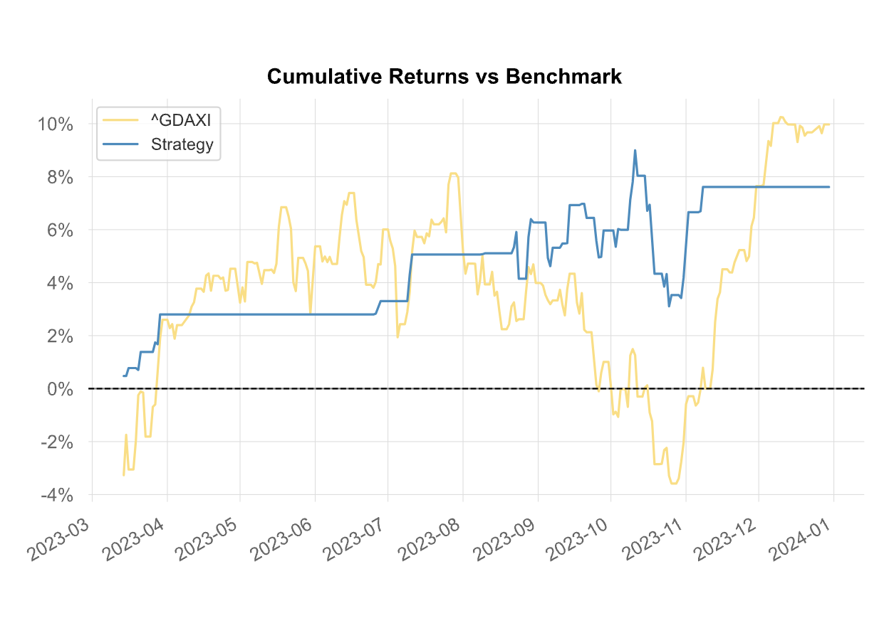 | 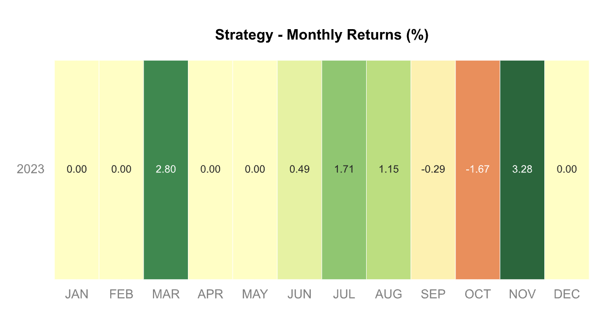 | 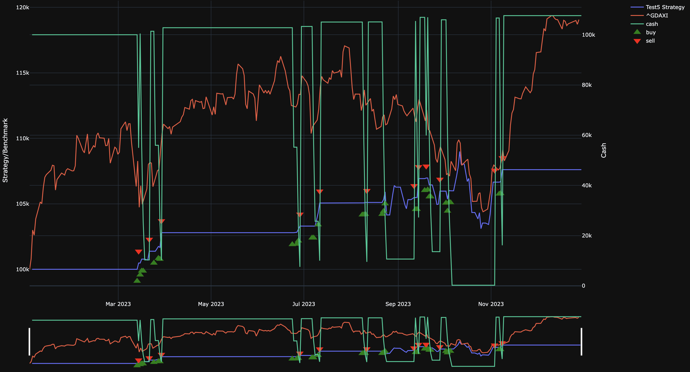 |

For more detailed results, check out the [tearsheet](results/tearsheet.html) and the [trades](results/trades.html) executed by our model.

## Conclusion
This LSTM model demonstrates significantly greater precision compared to the model from Test 1. The primary difference lies in the prediction target: instead of predicting whether the next day’s Close value will be higher than the current day’s, this model forecasts the actual Close value for the next day. Additionally, the dataset has been enhanced by incorporating various technical indicators, contributing to the improved performance.

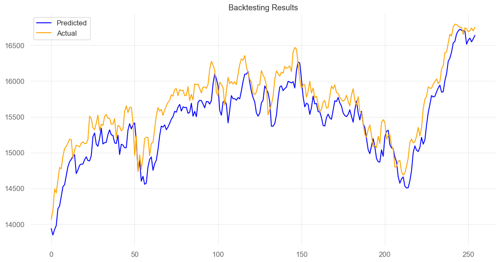
